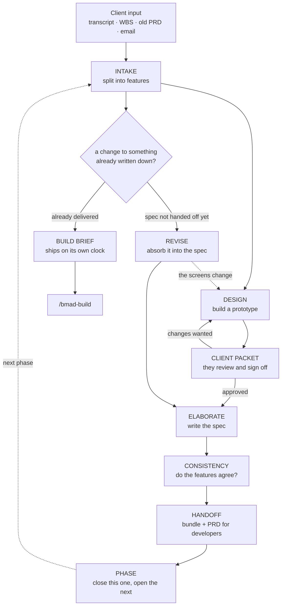

# Feature Discovery Workflow (fdw)

A toolkit for business analysts working with clients. It takes the messy things a client gives you — a recording of a call, a spreadsheet of work items, an old requirements document, whatever sales forwarded — and turns them into clear, approved feature specifications, ready to hand to developers.

You do not need to be a developer to use it. You type in plain English. It does the filing.

---

## 1. What this is, and the problem it solves

### The problem

You get on a call with a client. They describe what they want. You take notes.

Then it happens again next week, and they contradict themselves. A spreadsheet arrives from sales with different wording for the same thing. Three months later a developer asks "who asked for this?" and nobody can say. At the end, you write a big requirements document, and half the things in it were never really agreed.

Two things go wrong over and over:

1. **The written document comes too early.** You describe the feature in words, the client nods, and then you build it and they say "that's not what I meant." Clients cannot picture a paragraph. They can react to a screen.
2. **The reasoning disappears.** Decisions get made on calls and lost. Nobody remembers why a thing works the way it does, so it gets re-argued.

### What this does instead

It turns the usual order around. **You show the client pictures first, get their agreement, and write the specification afterwards.**

The full path looks like this:

```
messy client input  →  a list of features  →  a working prototype
                    →  client says yes  →  a written spec
                    →  a requirements document for developers
```

That is the happy path, and it is not the whole picture, because clients change their minds constantly. There are two ways back into something already written down: if developers do not have it yet, the specification reopens and absorbs the change; if they do, it is amended in place and the fix ships on its own without waiting for the next round. Neither happens silently.

And it keeps a record. Every single requirement it writes down can be traced back to the moment someone actually asked for it — the exact sentence, from the exact call, on the exact date. When a client says "we never asked for that," you can show them. The same is true of every change they asked for after signing something off, which on a fixed-price contract is the difference between absorbing it and billing for it.

### What you get out of it

- **Features, separated out.** One transcript that rambles across five topics becomes five clearly-separated features.
- **Prototypes** the client can look at and react to, built to look like their real product.
- **A review document** for the client, written in their language, with no internal jargon in it.
- **A specification per feature**, with every requirement traceable to its source.
- **A requirements document (PRD)** per delivery phase, handed to the developers.
- **A record of every decision**, that survives from one phase to the next.
- **A trail for every change** the client asked for after approving something — what they said, when, and which requirements it moved.
- **An accurate record of what actually shipped**, kept true when delivered work is changed later, so each phase is written against the real product rather than against an old document.

### One term you will see everywhere

A **feature** is one deliverable thing — "Course list", "Certification", "Session scheduling". Each one gets an ID like `F-001` and its own folder. That ID never changes, even if the feature moves to a later phase. That is how nothing gets lost.

---

## 2. Installation

### Before you start

You need two things on your computer:

| Thing | What it is | How to check |
| --- | --- | --- |
| **Node.js** | Runs the installer | Type `node --version` in a terminal |
| **uv** | Runs the toolkit's Python parts | Type `uv --version` in a terminal |

If `uv` is missing, the simplest fix is to ask your AI assistant: *"install and set up uv for me."*

### Installing

Open a terminal, go to the folder for your client project, and type:

```
npx bmad-method install
```

You will be asked a series of questions. Here is what to answer:

1. **Install to this directory?** → **Yes** (make sure it is the right client project)
2. **How would you like to proceed?** → **Install** (or **Modify BMAD Installation** if BMAD is already there)
3. **Select official modules to install** → keep **BMad Method** selected. That one is required — this toolkit hands its finished work over to it.
4. **Do you want to install custom or community modules (Git URL or local path)?** → **Yes**
5. **Git URL or local path** → paste:

   ```
   https://github.com/Relevant-S/bmad-fdw
   ```

6. You will see a warning: **UNVERIFIED MODULE: This module has not been reviewed by the BMad team.** This is expected. It appears for anything not published by BMAD themselves. Continue.
7. It will find **Feature Discovery Workflow v1.0.0**. Confirm.

### After installing

Run the setup once:

> **"setup Feature Discovery Workflow"**

It will ask you a handful of questions — where to keep your files, what the client is called, and so on. Every question has a sensible default, so *"accept all defaults"* is a perfectly good answer the first time.

One question is worth reading properly: **"Is this a new build, or a project already partway through delivery?"**

- **New build** (the default) — setup creates your working folder and opens phase 1. Done.
- **Already in flight** — it asks which phase the project is actually on, and whether you have anything describing what is already live. See *[Starting on a project that is already running](#starting-on-a-project-that-is-already-running)*.

Either way, you can start immediately after setup finishes.

---

## 3. The workflow, start to finish

Here is the whole path, with what you actually type.



The two paths on the right are the answer to "the client changed their mind", and which one you are
on is decided by the module, not by you: a change against a feature that has not been handed to
development reopens its spec, and one against a feature that has been amends the spec in place and
goes straight to a build. The second never waits for the next phase — that is the whole point of it.

### Step 1 — Intake: get it into the system

**You type:**

> "New call came in. Here's the transcript: `docs/calls/academy-2026-08-22.json`"

**What comes back:** it reads the file, pulls out the features being discussed, and shows you a list.

> I found three features in this call:
> - **Academy** — certification, trainings and course pages
> - **Events agenda layout** — blocks are squashed, needs sections
> - **Session list improvements** — client feedback on Events
>
> Shall I record these?

You say yes, or you correct it. It writes each feature into its own folder, along with the exact quotes that justify it.

The file does not need to be tidy. It handles recordings in any language, including messy automatic transcriptions.

### Step 2 — Design: show them a picture

**You type:**

> "Draw me the Academy feature"

**What comes back:** a working prototype — real screens, built using your project's actual look and feel. Along with it, a list of the assumptions it had to make.

> Built two screens: Course list and Course page.
> Three things I assumed, which nobody has confirmed:
> 1. A course can be published before any dates are scheduled
> 2. Certification only unlocks when every session is complete
> 3. Courses are listed newest first

You walk the screens and correct them:

> "The date field should take a range, not one day. And the tabs are squashed."

It fixes them, and — importantly — **writes down what you corrected**. Those corrections are requirements nobody had written down yet. That is where a lot of the real detail comes from.

Then it does one more thing automatically: it walks through the screens as if nothing exists yet. No courses, no data, empty. This catches the steps everybody forgets, like "how does the very first course get created?"

### Step 3 — Client packet: get sign-off

**You type:**

> "Send it to the client"

**What comes back:** a single self-contained web page you can email. It has the screens, a plain-language description, the assumptions phrased as questions they can answer, and a short list of what you need from them.

It will **refuse** to include any internal wording — no feature IDs, no sizing, no words like "spec" or "backlog". If any of that has crept in, it tells you which sentence to rewrite.

When the client replies:

> "The client came back on Academy — they're happy, but certification needs a downloadable PDF."

It records their answer, in their words, and marks the design approved.

### Step 4 — Elaborate: now write it down

**You type:**

> "Write the spec for Academy"

**What comes back:** the full written specification. What the problem is, the rules, every requirement, what is deliberately out of scope, what is assumed, and what is still unanswered.

Every requirement carries a note saying where it came from — either a quote from a call, or a design decision the client signed off on.

When you are happy:

> "Approve the spec"

It will **stop you** if any question is still unanswered, and tell you which ones. That is deliberate. An unanswered question at this stage becomes an expensive problem later.

Once approved, each requirement gets a permanent ID like `F-001-R-03`, which never changes.

### Step 4b — When the client changes their mind

They will. This is the normal case, not the exception, and the specification is deliberately cheap to change:

> "They want capacity shown on the card, not in the dialog"

If the phase has not gone to developers yet, the spec simply reopens and you absorb the change — and if it affects what is on screen, the client gets a short round on the changed screens, because their sign-off covered the screens they saw.

If it has already gone to developers, the spec is not reopened and the change ships on its own instead. See **Step 6b**.

Either way it is recorded: what changed, who asked, when, and which requirements now carry it.

### Step 5 — Consistency: do the features agree with each other?

**You type:**

> "Do these features conflict?"

**What comes back:** a report. Two features that contradict each other. Two features that are secretly the same feature. Features that depend on each other, and therefore the order they should be built in.

> Academy repeats most of the Events agenda. Don't merge them — Academy adds enrolment and certification that Events has no concept of. But build Events first, because Academy inherits its agenda.

### Step 6 — Handoff: give it to the developers

**You type:**

> "We're done with phase 1, make the PRD"

**What comes back:** first, a check. How many unanswered questions would go to the developers? Which features are not ready? What is missing?

> 4 features ready, 12 requirements, 0 unanswered critical questions.

Then it packages everything up and produces the requirements document (PRD) that developers work from.

It also writes you an **agenda for your next client call** — the questions still outstanding. When you have that call and feed the recording back in, those questions get closed automatically. The loop closes itself.

### Step 6b — An urgent fix to something already delivered

Phase 1 shipped months ago, you are deep in phase 2, and the client needs something in the delivered product changed now:

> "They need the badge label fixed on retired categories — this can't wait for phase 2"

**You do not scope it into phase 2 and you do not reopen phase 1.** It gets a short brief of its own and goes straight to `/bmad-build`, the toolkit's build workflow, which is built for exactly one change of this size. A full requirements document here would mean running a whole scoping process for a one-line fix.

Once it is live, the record of what shipped is rebuilt so it stays true — which is what stops phase 3 being written against a product that no longer behaves the way phase 1's document described.

### Step 7 — Phase: move on to the next round

**You type:**

> "Close phase 1 and scope phase 2"

Everything unfinished carries forward. Nothing is lost. See section 6.

### If you would rather not remember any of this

Just type:

> **"Talk to Vadim"**

Vadim is the assistant built into this toolkit. He reads where everything stands and tells you what to do next. You can describe what you want in your own words and he picks the right tool.

---

## 4. The tools, one by one

There are nine. You rarely need to remember their names — describing what you want usually works.

---

### `fdw-setup` — install and configure

**What it does.** Sets the toolkit up in a project. Asks where to keep files, what the client is called, and where your project's design components live. Creates your working folder and opens phase 1.

**When to use it.** Once, after installing. Again if you want to change a setting.

**Say:** *"setup Feature Discovery Workflow"* · *"configure fdw"*

**Writes:** your settings, and an empty working folder ready to use.

**Example.** You run it, accept the defaults, and it replies that the discovery folder is created and phase 1 is open.

---

### `fdw-agent-ba` — Vadim, your starting point

**What it does.** Reads everything and tells you where you stand. Routes you to the right tool without you naming it. Makes small corrections on the spot.

**When to use it.** When you sit down and cannot remember where you left off. Or when you do not want to think about which tool you need.

**Say:** *"talk to Vadim"* · *"where are we"* · *"what's blocking"* · *"what should I do next"*

**Reads:** the feature list, open questions, recent decisions.
**Writes:** small corrections, and notes about how you like to work.

**Example.**

> **You:** where are we
>
> **Vadim:** Phase 2: 3 features, Academy specced and bundled, Events feedback shipped. Nothing blocked on the client. F-004 has no design and two features are waiting on it.

He never guesses. If he has not read something, he says so.

---

### `fdw-intake` — get client input into the system

**What it does.** Reads any document and pulls out the features. Splits one messy file into separate features. Recognises when a feature already exists and adds to it instead of duplicating. Notices when new input contradicts something you already recorded. Closes questions that the new document answers.

**When to use it.** Every time anything arrives — a call recording, a spreadsheet, an email, an old requirements document.

**Say:** *"new call came in"* · *"ingest this transcript"* · *"run intake on this WBS"* · *"process this handoff"* · *"check the discovery store"*

**Reads:** the file you give it, plus what is already recorded.
**Writes:** a folder per feature, with the evidence and quotes behind it.

**Example.** You hand it a 30-minute call recording. It comes back with three features, twelve pieces of evidence with timestamps, and five questions the client needs to answer.

**When the new document contradicts a spec you already approved**, it does not edit that spec — it raises a **change record** against the feature, with the quote and the timestamp behind it. Whether that change reopens the spec or ships on its own is decided from how far the feature has got, and you are told which. It also asks whether the change affects the screens, because that decides whether the client has to look again.

**Below an approved spec there is nothing to change**, so the same contradiction becomes an open question instead. One fact, one place — it is never recorded as both.

---

### `fdw-design` — build the prototype

**What it does.** Builds working screens for one feature, using your project's real components so it looks like the actual product. Records every assumption it makes. Takes your corrections and logs them. Walks the empty starting state to find missing steps.

**When to use it.** After intake, before you talk to the client again. This is the step that saves the most time.

**Say:** *"draw me this"* · *"prototype this feature"* · *"design F-003"* · *"reproduce the current screens"* · *"show me what this looks like"*

**Reads:** the evidence for the feature, and your project's real code.
**Writes:** the prototype, the assumptions, the corrections log, the empty-state findings, and a record of where each screen was copied from.

**Example.** You ask for the Academy screens. Two rounds of corrections later they are right, and the empty-state walk has found three steps nobody had thought about.

**How it gets the look right.** On a product that already exists, it does not draw from imagination. It finds your application, finds the page most like the one it needs, and copies that as the starting point — the same colours, the same spacing, the same table style, because they are the same file. Then it changes only the part your feature changes.

Before you see anything, it checks its own work: every screen has to name the real file it came from, and that file has to exist. If it drifted into inventing its own look, the check fails and it starts again. You should be correcting the feature, not the drawing.

**It stays inside one feature.** One run, one feature. It will not build the rest of your app around it, and it will not invent a navigation menu — if the screens need a frame around them, it borrows your real one. Anything it draws that belongs to a different feature is treated as a mistake and blocked.

**If it cannot find your application**, it will ask you where it lives rather than guessing. Tell it once and it remembers. It only starts from a blank page if you tell it there is genuinely nothing there yet.

---

### `fdw-client-packet` — the document the client signs

**What it does.** Builds a single web page for the client: pictures of the screens, a plain description, the assumptions as yes/no questions, and what you need from them. The client answers in the page itself and sends the answers back. Then it reads those answers in and records the sign-off.

**When to use it.** When the prototype is ready to show. And again when they reply.

**Say:** *"send this to the client"* · *"build the client packet"* · *"prepare the review"* · *"the client came back on Academy"*

**Reads:** the prototype and the assumptions.
**Writes:** the client page, the screenshots, and their recorded answers and approval.

**Example.** It produces one file you can email. It refuses to send anything containing internal wording, and tells you exactly which sentence to change.

**The pictures.** It takes the screenshots itself, using a browser you already have — you never take them by hand. Every screen in the feature, always the same size, always the whole page rather than just the top of it. Two people building the same packet get the same pictures. If there is no suitable browser on your machine it says so, and the packet describes the screens instead of showing them.

**How the client replies.** Under each question there is an answer box; next to each assumption, *That's right* / *Not quite*. At the end they type their name and say whether the screens are right. Their answers save as they type, so they can start on a phone and finish later.

When they press **Finish**, the page gives them a block of text to copy into their reply email — or a file to download if they prefer attachments. It also shows them, in plain words, exactly what they are sending. The page never sends anything anywhere by itself, which is worth saying to them: it is safe to open and it is not tracking them.

**Several people can answer.** Send the same file to as many stakeholders as you like. Each one replies separately, and you feed all their replies in together. You get one merged picture with each answer attributed to whoever gave it.

**When two people disagree**, it will not choose for you. It shows you both answers side by side and leaves that question open. Guessing which stakeholder to believe is exactly the mistake that ends up in a spec.

**Sign-off is not offered until it is real** — every question you asked has an answer, every assumption got a yes or a no, nothing is in conflict, and someone actually said yes. If it is holding back, it tells you which of those is missing.

**An assumption they skipped is not an assumption they agreed to.** If they answered nine of eleven and approved, the two they skipped are still guesses, and it says so rather than treating the silence as a yes.

**A follow-up round.** When the specification turns up a question only the client can answer, you can send a short second packet with just that question. It does not re-open the design they already approved, and it never overwrites the document you already sent them.

**If they contradict a spec that is already approved**, that is not a note to pass back to the design step — it is a change, and it is handed to you as one, with the command to record it. A correction that goes back as a comment leaves the specification quietly saying something the client has just told you is wrong.

---

### `fdw-elaborate` — write the specification

**What it does.** Writes the full spec for one feature from the approved design. Sizes it. Records what depends on what. Sorts the open questions into "must answer" and "can wait". Locks the requirement IDs when you approve. Reopens the spec later when the client changes their mind, and records what changed.

**When to use it.** After the client has approved the design. Not before — that ordering is the whole point. And again whenever a request lands against a spec you have already approved.

**Say:** *"write the spec"* · *"elaborate F-003"* · *"спєка"* · *"now describe this properly"* · *"approve the spec"* · *"they've changed their mind on this"*

**Reads:** the approved design, the corrections log, the original evidence, and any changes raised since.
**Writes:** the specification, including its revision history.

**Example.** Ten requirements for Academy. Two trace back to quotes from the call; eight trace back to design decisions the client signed off. Approving is blocked until two client questions are answered.

**Note.** Until you approve it, the spec is a scratchpad. Change your mind freely — nothing downstream is affected. That is deliberate.

**Every question it finds gets filed.** Writing a spec turns up things nobody has decided. Those go into the spec *and* into the master list the rest of the module counts — a question written only in the document is invisible to everything downstream, which is how a specification once reached development with eight unanswered questions in it.

**It will not let you approve a spec that still asks questions.** All of them, not just the urgent ones. If you genuinely need to proceed anyway, you can say so explicitly and it records what you let through, in the spec and in the log. What it will not do is let a question through that was never written down properly in the first place.

**If only the client can answer**, say *"send this to the client"* again — there is a short follow-up round for exactly this, which does not re-open the design they already signed off.

**When the client changes their mind after you approved the spec**, say so and it reopens it. Clients change their minds constantly and the whole reason a spec is cheap to change is that this is normal — but never silently. Reopening is recorded with a reason, so six weeks later "why did this move" has an answer.

It works out which of two situations you are in and tells you, rather than making you decide:

- **The phase has not gone to developers yet.** The spec reopens and you absorb the change. If the change affects what is on screen, it takes the feature back to the drawing step as well and sends the client a short round on the changed screens — they signed off on *those* screens, so a visual change means their approval no longer covers it.
- **It has already gone to developers.** The spec is not reopened. See `fdw-handoff` below.

**It will not take your word for it that you absorbed a change.** When you close one off, it compares the requirements against what they said when the change arrived. If nothing actually changed, it says so. Marking a change absorbed without changing anything is how a specification ends up disagreeing with the record of what the client asked for.

**Requirement IDs never move.** A requirement that changes keeps its number and is marked as amended; one that is withdrawn keeps its number *and its place* and is marked as superseded. Nothing is deleted, because the developers' document and the record of what shipped already refer to those numbers.

**It will not approve a spec with an open change against it** — and unlike an unanswered question, you cannot override this one. An unanswered question is something nobody has decided yet, and choosing to proceed anyway is a judgment you are allowed to make. An open change is something you have already been told the spec gets wrong. There is no version of approving that on purpose.

---

### `fdw-consistency` — check the features against each other

**What it does.** Finds contradictions between features, spots two features that are really one, works out the build order, catches the same thing being called three different names. Also answers "which of our features does this new request touch?"

**When to use it.** After intake adds new features. Before any handoff. Any time you are unsure whether things hang together — or when a request comes in and you are not sure what it affects.

**Say:** *"check consistency"* · *"do these features conflict"* · *"run the audit"* · *"what order should we build these"* · *"what does this request touch"*

**Reads:** every feature and spec, in every phase, plus what has already shipped.
**Writes:** a report, plus the recorded relationships between features.

**Example.** It reports that Academy repeats most of Events, recommends building Events first, and notices that Academy was approved ahead of the two features it depends on.

**It compares against what has already shipped, not just against the phase you are in.** Narrowing to one phase narrows which features it raises findings *about* — it never narrows what they are measured against. This matters more than it sounds: the most expensive contradiction on an engagement is a feature being written now that repeats or contradicts something delivered two phases ago, and that one is invisible if you only look at the current round.

**Ask it what a request touches** before you record a change anywhere. It searches everything, shipped work included, and each answer tells you whether that feature has gone to developers — which is what decides how the change is handled. It gives you ranked candidates and the command for each, not a decision; one request genuinely can touch three features.

---

### `fdw-phase` — manage delivery rounds

**What it does.** Decides what goes in the next phase. Moves features between phases without losing anything. Closes a phase and opens the next one, carrying unfinished work across.

**When to use it.** When scoping a round of work, when something slips, and at the end of every phase.

**Say:** *"scope phase 2"* · *"move this to the next phase"* · *"close phase 1"* · *"are we done with this phase"* · *"show me the phases"*

**Reads:** every feature, its size, and what depends on what.
**Writes:** phase records, and a report of the whole engagement.

**Example.** It proposes phase 2, notes that two features must move together because they depend on each other, and warns you that phase 1 cannot close yet because one feature is unfinished.

---

### `fdw-handoff` — give it to the developers

**What it does.** Checks what is ready. Counts the unanswered questions that would reach developers. Bundles the approved specs. Produces the requirements document. Writes the agenda for your next client call. Keeps the record of what has shipped accurate, and sends an urgent change to already-delivered work straight to a developer without waiting for the next phase.

**When to use it.** At the end of a phase — and any time the client needs something fixed in what they already have.

**Say:** *"hand off phase 1"* · *"we're done, make the PRD"* · *"bundle these specs"* · *"run the pre-flight"* · *"they need this fixed in what we already shipped"*

**Reads:** every approved spec in the phase, plus the record of what previous phases shipped.
**Writes:** the bundle, the PRD, the next call's agenda, and the brief for an urgent change.

**Example.** Pre-flight says 4 features, 12 requirements, 0 unanswered critical questions. It bundles them and produces the PRD.

**It stops if a critical question is still open.** The pre-flight report itself never stops you — it is what you run to decide. Bundling does: it will not hand development a specification with an unanswered blocker in it. You have two ways forward and it names both — bundle only the features that are clean, or say explicitly that you are proceeding anyway and why. Either way the decision is written into the bundle where the next person will find it.

This is the last gate anything passes. A question that arrives *after* a spec was approved never goes past the earlier check again, so this is the only place it can be caught.

**It also stops if a change is open against a spec in the bundle.** That is a sharper problem than an unanswered question, and worth separating: an unanswered question means nobody has decided something yet. An open change means you have already been told this specification is wrong and it still says the old thing. Handing that to developers is handing them a document you know is false.

A change against a feature in a *different* phase never blocks your bundle. It ships beside the phase, not inside it — holding a round of work for something that already missed it is exactly backwards.

**An urgent change to something already delivered.** A feature shipped in phase 1, you are writing phase 2, and the client needs it changed now. That is not a new feature and not a spec revision, and it must not wait for phase 2's handoff:

> *"They need the badge label fixed on retired categories — urgent, can't wait."*

It writes a short brief and you hand that to `/bmad-build`, the toolkit's build workflow. **Not a PRD** — a requirements document is a tool for scoping a whole round of work, and its full process is exactly the ceremony that urgency rules out. `/bmad-build` is built for precisely one change of this size.

The brief stands on its own for a developer who has never seen any of your discovery notes: what changed and the client's own words for it, how the feature behaves today, what must be true afterwards, what not to touch, and the **real files in your codebase** the prototype was originally copied from — which is the single most useful thing this toolkit knows about code it does not own.

It carries the delivered behaviour the change actually touches, and tells you how much it left out and where the rest is. Handing a build agent thirty-three requirements to explain a one-line change spends its whole attention before the change is even described.

**The feature's status does not change.** It shipped; it stays shipped. That is a fact about what developers have, not about what you are working on, and moving it would corrupt the record of what phase 1 actually delivered.

**Keeping "what has shipped" true.** Once the change is live, the spec is amended in place and the record of what shipped is rebuilt from it — each amended requirement marked with the change that moved it, and the original ship date left alone, because the phase shipped when it shipped. That record is what later phases are written against, so a phase 3 feature is built on what the product actually does rather than on what phase 1's requirements document said it would.

There is a window between "the spec now says it" and "it is actually live". In that window the record says so explicitly rather than showing you the new wording as though it had already shipped.

---

## 5. Where your documents live

Everything goes in one folder, by default `_bmad-output/discovery/` inside your project.

```
discovery/
├── registry.json         The master list of every feature and where it stands
├── decisions.md          Why things are the way they are. Never deleted.
├── questions.md          Every open question, grouped by who owes the answer
├── glossary.md           Your project's vocabulary
├── as-built.md           What has actually shipped so far
│
├── sources/              Every document you fed in, kept exactly as received
│
└── phases/
    ├── phase-1/
    │   ├── features/
    │   │   └── F-001-academy/
    │   │       ├── signal.md      The evidence and quotes behind this feature
    │   │       ├── design/        The prototype and the design notes
    │   │       ├── spec.md        ← the specification
    │   │       ├── changes.md     Changes raised after approval
    │   │       └── client-packets/  ← the pages you sent the client, and their replies
    │   └── handoff/               ← the bundle and the next call's agenda
    └── phase-2/
```

### The three files you will actually open

| File | What it is for |
| --- | --- |
| `spec.md` inside a feature folder | The specification. This is the main output. |
| `client-packets/*.html` inside a feature folder | What you emailed the client. Open it in a browser. |
| `decisions.md` | Why anything is the way it is. Search this when someone asks. |
| `changes.md` inside a feature folder | Every change the client asked for after you approved that spec, and what it moved. |

### The one file not to edit

`registry.json` is the master index. The toolkit keeps it in step with the folders automatically. If you edit it by hand they can fall out of step. If you think they have, say *"check the discovery store"* and it will tell you exactly what is wrong.

### How a feature moves along

Each feature has a status showing how far it has got:

```
candidate → sliced → designing → client-review → design-approved
          → speccing → spec-approved → handed-off → shipped
```

You do not need to memorise this. Three rules are worth knowing, because the toolkit enforces them:

- **A spec cannot be written until the client has approved the design.**
- **A feature cannot go to developers until its spec is approved.**
- **Going backwards is normal and always allowed** — that is what happens when a client changes their mind before the work has gone to developers. It is never silent: the reason is recorded.

Once a feature reaches `handed-off`, though, it stops moving. Developers have it, and that status is a statement about them rather than about you. A change at that point amends the specification in place and ships beside the phase; the feature stays where it is, so the record of what each phase delivered stays true.

---

## 6. How phases work

A **phase** is one round of delivery — a chunk of work the client buys, developers build, and ships. Then you start the next one.

### Phase 1

Setup opens phase 1 for you. Everything you take in lands there by default. You work through the features, hand them over, and close it.

### Starting on a project that is already running

Most real work is not a fresh start. You get handed a project that has been going for months and is on its third round of delivery.

Tell setup it is **already in flight**, and it asks two things.

**Which phase is the project actually on?** Answer in whatever form is natural — `3`, `phase-3`, or a fractional one like `2.1` if you are mid-way through a split phase. That becomes your starting phase, instead of phase 1.

**Is there anything describing what already exists?** A previous requirements document, a handover note, or just a couple of sentences typed into the chat. Any of those work, and "nothing" is a fine answer too.

Whatever you give it goes into the **as-built baseline** — the record of what is already live. That is what the prototype tool reads when you ask it to rebuild an existing screen, and what the spec tool checks so it does not re-specify something that already exists.

**What it will not do is invent the earlier phases.** If you start at phase 3, phases 1 and 2 simply are not in the system. That is deliberate. This toolkit's firmest rule is that it never reports anything it has not actually read, and creating two empty "completed" phases it knows nothing about would break that — and would make the unanswered-question trend meaningless, which is the one number worth watching.

So the phase history starts where you started. What came before lives in the as-built baseline, clearly marked as something you told it rather than something it verified.

Everything else behaves normally. Open phase 4 next, or go back and add phase 2 later if you need to — it always works out which phase comes before which from the number itself, not the order you created them in.

### Handing over and moving on

When phase 1 is done:

1. **Anything slipping to later, mark it now** — *"move Academy to phase 2"*. Do this **before** closing, or the reason it slipped will not carry across.
2. **Close phase 1** — it records how many questions were still unanswered, and links the PRD.
3. **Open phase 2** — everything unfinished comes with it.

### What carries across

- **Unanswered questions.** Still open, still assigned to whoever owes the answer.
- **Deferred features.** They **move**, keeping their ID, their evidence, their prototype, their spec, and the client's sign-off. Nothing is recreated from scratch.
- **Open change requests.** Things raised after a spec was approved, each with the quote behind it — plus anything you deliberately parked *for this phase specifically*, which resurfaces the moment it opens rather than being quietly forgotten.
- **The decisions log.** Every "why", from the beginning.
- **What has shipped.** So phase 2 features are written against what actually exists, not against a pile of old documents.

That is why a feature deferred from phase 1 to phase 2 still knows, months later, that the client approved its screens in August.

### Sub-phases

If you split a round, `phase-2.1` works exactly the same way.

### The number worth watching

Every time you close a phase it records **how many critical questions were still unanswered** at handoff. Watch that number across phases. If it is falling, this is working. If it is rising, questions are not getting chased and the phase reports will show it.

---

## 7. Troubleshooting and FAQ

### "No discovery store" / "Run fdw-intake first"

The working folder does not exist yet. Either run setup, or just feed it your first document — intake creates the folder itself.

### "moving sliced → client-review skips designing"

You are trying to jump a step. Each stage is a gate. Do the missing step first, or, if the work genuinely happened elsewhere, say so and it will let you past while recording that you skipped.

### It refuses to approve my spec

There are unanswered questions — any of them, not only the urgent ones. It will name them and say who owes each answer. Chase them, or approve anyway with *"approve it, I accept the open blockers"* — it records what was let through.

This refusal is the most valuable thing the toolkit does. Every question you close here is one that does not become a problem for developers.

### It refuses to build the client packet

Internal wording has crept in — a feature ID, a size, a word like "spec" or "sprint". It names the exact sentence and suggests a plain-language replacement. Fix that sentence and try again.

### "requirement has no provenance"

A requirement has been written that cannot be traced back to anything. Either find where it came from, or remove it. This one is not negotiable — an untraceable requirement is the thing that causes arguments with clients later.

### My transcript is in another language

Fine. It handles any language, including rough automatic transcriptions. It writes your documents in English but keeps the original quotes exactly as spoken, because a translated quote is not evidence.

### It cannot read my file

Word documents and PDFs cannot be read directly. Save as plain text or Markdown first, or paste the contents in.

### I fed in the same transcript twice

It notices and stops. If it is a *corrected* version of a file you already used, it spots that too and asks whether it replaces the earlier one — say yes, or you will get every feature twice.

### The prototype will not run

You need Node.js installed to run prototypes. Without it they are still generated, you just cannot click through them. You can still send the client packet.

### The prototype does not look like our product

Say *"check the grounding"*. It will tell you which screens are not traceable to a real file in your codebase, and rebuild those from the real thing. The usual cause is that it never found your application — see the next entry.

### It says it cannot find my components

The module looks in your project folder, then one level up, then in the folders beside it. That covers the common setup where the documentation lives in one folder and the application in another. If it still cannot find it, just tell it the path. It saves the answer, so you only say it once.

Do not let it carry on without an answer on a project that already exists. It will draw something that looks like a redesign, and your client will react to the redesign instead of the feature.

### It generated screens for a different feature

That should now be blocked before you ever see it. If it happens, say *"check the grounding"* — the extra screens are reported by name and removed. Each run covers exactly one feature.

### It says it cannot capture the screenshots

It needs Chrome, Chromium, Edge or Brave on your machine — any one of them. If you have one but it cannot find it, tell it where: set `CHROME_PATH` to the browser, or just say where it is and it will use that.

You can still send the packet without pictures. It will describe the screens and offer the client a walkthrough instead. Say that to them plainly rather than letting them wonder where the images went.

### The client replied but nothing was recorded

Their answers only come back if they used the Finish button and sent you the block it produced. If they just wrote you an email in their own words instead, that is fine — say *"the client came back on Academy"* and hand over the email. It gets read in the same way, and every answer keeps a trace back to what they actually wrote.

### Two stakeholders gave different answers

That is reported, not resolved. You will see both answers with names against them, and that question stays open. Go back to them and get one answer — or make the call yourself and record it. Nothing will quietly pick one for you.

### Figma is not responding

Figma is optional and off by default. The prototype is the main path. Carry on without it.

### It will not let me approve the spec

It refuses while the spec still asks a question — any question, not just the urgent ones. Close what you can, send the client-owned ones back with a follow-up packet, and if you genuinely have to proceed anyway say so explicitly; it records what you let through.

If it says questions are "not in the ledger", the spec has questions written in it that were never filed. Run the one command it prints. That filing step is what makes them count anywhere.

### It refuses to bundle the phase

Either a critical question is still open on one of the features, or a change is. Bundle only the clean ones — it names them — or say explicitly that you are handing off anyway and why. That reason is written into the bundle so the next reader knows.

### It will not let me approve, and "accept the open blockers" does not work

Then it is a change, not a question. You can knowingly hand over an unanswered question; you cannot knowingly approve a specification that contradicts something already on record. Absorb the change first — say *"they've changed their mind on this"* and it walks you through it.

### It says I did not really absorb the change

You marked a change absorbed but the requirements are word for word what they were when it arrived. Edit the spec so it actually says the new thing, then close the change against the requirements that now carry it. If the answer is that you are *not* going to act on it, close it as dropped with the reason — that is a real outcome and it gets recorded.

### The client changed their mind about something we already delivered

Do not add it to the current phase and do not reopen the closed one. Say *"they need this fixed in what we already shipped"*. It writes a short brief and you hand that to `/bmad-build`. The feature stays marked as delivered, and once the fix is live the record of what shipped is rebuilt so later phases are written against the real product.

### It says the phase is closed

You are trying to add a feature to a phase that already went to developers, or move one into it. That phase's record is what it handed off, and adding to it now would make that record untrue — put the work in the open phase instead.

Raising a *change* against something in a closed phase is different and is allowed, because that is exactly what an urgent fix to delivered work is.

### A change I parked came back

That is deliberate. When you defer a change to a named phase, it resurfaces the moment that phase opens. Deferring is a destination, not a way of losing something.

### My phase history looks incomplete

If you started on a project already in flight, the earlier phases are genuinely not there, on purpose. What shipped before is in `as-built.md`, not in the phase list. Nothing is broken.

### The numbers look wrong

Say *"check the discovery store"*. It compares the master list against the folders and tells you exactly what disagrees.

---

### FAQ

**Do I need to know how to code?**
No. You type in plain English. The prototypes are built for you.

**Do I have to use all ten tools?**
No. Intake and elaborate are the core. Everything else is there when you need it.

**Can I skip the prototype and go straight to the spec?**
It will stop you, and that is on purpose. Writing the spec first is the failure this whole approach exists to fix. If you truly need to, say so and it will let you past.

**We're already halfway through a project. Can I still use this?**
Yes — that is the "already in flight" option at setup. You start at the phase the project is really on, and tell it what already exists. See section 6.

**I told setup phase 1 but we're actually on phase 3.**
Run setup again and choose "already in flight". If you have already taken features in, do not re-run setup — say *"open phase 3"* and then *"move these to phase 3"* instead.

**Can I run more than one client project?**
Yes. Install it separately in each project folder. Each keeps its own records.

**What if the client changes their mind after approving?**
That is expected, and it is cheap on purpose. It opens a change record with the client's own words behind it, and works out which of two situations you are in. If the phase has not gone to developers, the spec reopens and you absorb it — and if the change affects the screens, the client sees the changed ones again. If developers already have it, the spec is amended in place and the change ships on its own through `/bmad-build` rather than waiting for a phase it has already missed. Either way nothing is rewritten quietly: the reason, the source and the requirements it moved are all recorded.

**Something urgent broke in what we already delivered. Do I wait for the next phase?**
No. That was the old answer and it was wrong for anything urgent. Say *"they need this fixed in what we already shipped"* — it writes a brief for `/bmad-build` and the fix ships on its own clock. The phase you are currently scoping is not disturbed.

**Does a change to delivered work go through a PRD?**
No. A requirements document is for scoping a whole round of work; running that process for one change is the delay you are trying to avoid. It goes to `/bmad-build`, which is built for a single change of that size.

**How do I know which features a request affects?**
Ask: *"what does this request touch?"* It searches every feature in every phase, including delivered ones, and tells you for each whether developers already have it — which is what decides how the change is handled.

**Where does the final requirements document go?**
Into your normal BMAD output folder, produced by BMad Method's own PRD tool. This toolkit prepares the inputs; that tool writes the document.

**Something is stuck and I do not know what.**
Ask Vadim: *"what's blocking?"*

---

## Getting help

- Ask Vadim first — *"talk to Vadim"* — he can usually see what is wrong.
- Run *"check the discovery store"* if the numbers look off.
- Issues: [github.com/Relevant-S/bmad-fdw](https://github.com/Relevant-S/bmad-fdw)

Built on [BMAD Method](https://bmadcode.com/).
